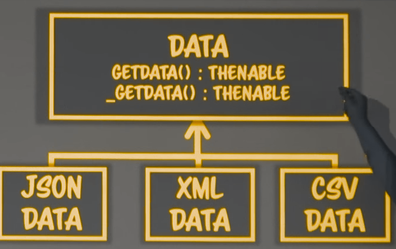
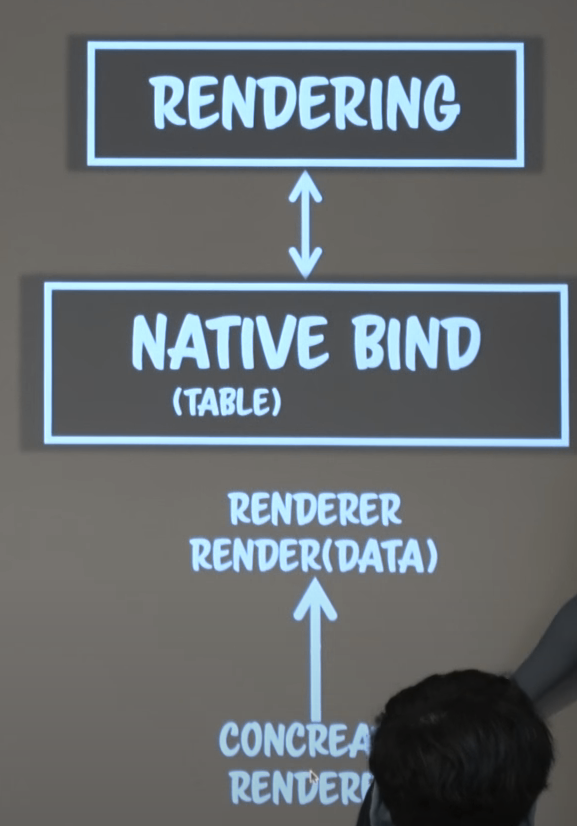

# es6 & view pattern

```js
<!doctype html>
<html>
  <head>
    <meta charset="utf-8">
    <title>CodeSpitz71-1</title>
  </head>
  <body>
    <section id="data"></section>
    <script>
    const Table = ()=>{
      //이렇게 만든 이유는 class만 알아야하는 여러가지 private한 내용들을 잡기위해 closure를 만든것이다. 그리고 const는 class형을 함수로 바꿀 수 없다. const같은 상수로 하려면 클로저를 잡을 수 없으니 익명함수를 만들고 익명함수안에서 클래스가 return 되도록 한것이다. class안에 클래스만 알아야하는 자유변수를 넣는다.

      // 이곳엔 class만 인식할 수 있는 static private를 놓는다.
      const Private = Symbol();
      return class{
        //constructor, public methods, private methods를 넣는다.
        constructor(parent) {

        }
        async load(url) {

        }
        render(){

        }
      };
    })();
    const table = new Table("#data);
    table.load("71_1.json); //왜 로드 다음에 렌더로 안불렀을까 ? 비동기라서 이다! 어쩔 수 없었다.
    </script>
  </body>
</html>
```

프로그래밍을 한다는 의미는 나만의 단어와 의미체계를 만든다는것이다.
프로그래밍이란 과정을 나만의 언어를 만들어가는 과정과 같다 by 켄트백
그래서 위의 코드처럼 한국말 처럼 알아들을 수 있게 표현할 수 있어야 하고, 느낄 수 있어야한다.

좀더 table 쪽을 살펴보자.

```js
const Table = ()=>{
      const Private = Symbol();
      return class{
        constructor(parent) {
          if(typeof parent != 'string' || !parent) throw "invalid param";
          this[Private] = {parent};
        }
        // load(url) {
        //   fetch(url).then(response=> {
        //     return response.json();
        //   }).then(json=>{
        //     this._render();
        //   });
        // }
        async load(url) {
          const response = await fetch(url);
          if(!response.ok) throw "invalid response";
          const json = await response.json();
          const {title, header, items} = json;
          if(!items.length) throw "no itmes";   // data validation을 한다. 모든 입력은 반드시 validation을 한다. 절대로 입력값을 믿지 말아야한다. 이 밑으로 얼마나 validation을 하냐가 프로개발자인지 아닌지 알려준다.
          Object.assign(this[Private], {title, header, items});
          this._render(); //render에 인자를 안보내는걸 보면 렌더에 그릴 정보가 이미 this에 속성으로 잡혀 있구나라고 알 수 있어야한다.
        }
        _render(){  //_는 js3.1부터 있던 것으로 이것은 private 메소드니까 사용하지 말라는 소극적인 컨벤션이다. 내부에서만 호출하겠다는 의미이다.
          //의사코드를 작성해서 진행한다. 의사코드의 핵심은 해야될 일이 아니라, 순서대로 할 일이다.

          //부모, 데이터 체크       부모 부터 체크하는 이유는 부모가 없으면 다른게 되도 안되기 때문이다.
          const fields = this[Private], parent = document.querySelector(fields.parent);
          if(!parent) throw "invalid parent";
          if(!fields.items || !fields.items.length) {   // 이건 이미 위에서 검증했기 때문에 여기 있을게 아니다. 하지만 이건 데이터를 검증하는 코드라 아니라 데이터가 바른데 경우의 수를 나누는 코드이다. 이것은 데이터 정책이 두 곳에 있기 때문에 맞지 않는것이다.
            parent.innerHTML = "no data";
            return;
          } else parent.innerHTML = "":
          // table 생성
          const table = document.createElement("table");
          //캡션을 title로
          const caption = document.createElement("caption");
          caption.innerHTML = fields.title;
          table.appendChild(caption);
          //header를 thead로
          table.appendChild(
            fields.header.reduce((thead, data) => {
              const th = document.createElement("th");
              th.innerHTML = data;
              thead.appendChild(th);
              return thead;
            }, document.createElement("thead"));
          )
          //items를 tr로
          // 부모에 table삽입
          parent.append(
            fields.itmes.reduce((table, row) => {
              table.appendChild(
                row.reduce((tr, data) => {
                  const td = document.createElement("td");
                  td.innerHTML = data;
                  tr.appendChild(td);
                  return tr;
                }, document.createElement("tr"));
              );
              return table;
            }, table);
          );

          // 왜 sellector를 받는 시점에 부모를 확정짓지 않고 _render에서 부모를 만드려고 할까 ? 비동기이기 때문이다. 테이블 만드는 시점에 꼭 부모가 존재하고 있지 않아도 된다는 것이다. 그럼 미리 부모를 만드는 짓을 안해도 된다. 
        }
      };
    })();
    const table = new Table("#data);
    table.load("71_1.json); //왜 로드 다음에 렌더로 안불렀을까 ? 비동기라서 이다! 어쩔 수 없었다.
```

나의 의도를 코드로 적는 연습을 해야한다. 내가 왜 그렇게 했는지 충분히 코드로 작성해야한다. 주석 쓰지 마라.

조각과 소조는 다르다. 프로그래밍은 소조에 가깝다. 진흙을 붙히는 것이다.

함수에게 값을 넘길 수 있는 방법은 2가지 뿐이다. 인자로 넘기던지 인자 외적인것(전역참조 하지만 전역 참조는 위험하니 지역참조를 해야한다. 이게 컨텍스트라는 개념이다. instance의 것만 참조하라는 개념이다.)으로 넘기던지.

메서드의 기본적인 조건은 instance의 상태를 공유하는 함수의 집합이다. 그래서 _render에 속성값을 인자로 보내는것이 잘못된것이다. 인자를 보내지 않는건 render가 메서드이기 때문이다. 인자로 받으면 또 검증을 해야하며, 이미 검증을 끝났으니 속성으로 잡고 있는것이다. 인자로 보내면 _render는 이게 외부에서 온건지 아니면 검증되서 온건지 모른다. 그래서 render안에서 중복으로 검증을 하게 되는 문제가 발생한다.
함수와 메서드는 다른것이다.

## 에러의 3단계

1. 컴파일 에러(js는 인터프리터 언어이기 때문에 syntax 에러밖에 안난다.)
2. runtime error
    - 런타임 에러는 잡기가 굉장히 어렵기 때문에 무조건 throw를 던져서 멈춰야한다.
3. context error
    - runtime에 throws를 하지 않고 return을 해서 죽진 않는데 동작은한다.
    - 급여가 반만 들어오는 그런 문제..

## 프로그래밍 세계에서 유일하게 변하지 않는 원칙은 모든 프로그램은 변한다라는 원칙이다

이미 작성된 복잡하고 거대한 프로그램을 어떻게 변경할까?

***격리(isolation)***를 시켜야한다.
이쪽에 변화가 일어나면 다른 곳은 변화가 일어나지 않는다는 것을 의미한다.

결국 소프트웨어공학의 상당 부분은 격리 전략이다.

격리 전략의 기본은 ***변화율에 따라 작성하기***이다. load함수안에 테이블을 그리지 않고 _render로 뺐는데 데이터를 소비해서 dom을 그려내는 변화율과 데이터를 로딩해서 데이터를 처리하는 부분의 변화율이 다르기 때문이다. 변화율이란 수정요청이 오는 빈도가 다르다는 뜻이다. 데이터가 변했다는 뜻은 많다 적다를 떠나 표가 생긴게 마음에 안든다는 것과 전혀 다른 비율로 일어난다는 이야기이다. 표를 이쁘게해주세요 라는 요구사항과 데이터의 키가 변경 됬다거나 추가 정보가 들어왔다거나 데이터가 너무 커져서 다른 방식으로 로딩해야되 같은 완전 다른 분야에서 일어난다. ***변화율이란 빈도뿐만 아니라 분야도 의미한다.***

변화율이란 시간적인 대칭성으로 변화의 원인과 주기별로 정리해야한다.

실전 수칙 -> ***강한 응집성 & 약한 의존성***

단일 역할 모델은 이상적이지만 반드시 추구할 수 있는것은 아니다. 따라서 우리의 추구 방향은 강한 응집성과 약한 의존성이다.

## 테이블이 로딩이라는 역할을 가지면 안된다

```js
const Table = (_=> {
  const Private = Symbol();
  return class {
    constructor(parent){}
    async load(url){}
    _render(){}
  }
})();
```

책임과 권한을 묶어서 역할이라고 하는데 덩어리진 코드를 분리하는 기준이 된다. 그래서 data load <-> rendering <-> native binding(table) 로 분리한다. 이처럼 분리하는 것을 도메인 패턴이라고 한다. 렌더링까지 도메인이라고 하고, 도메인 밑을 네이티브 바인딩으로 본다.

분리하면 load <-> supply이다.

```js
const loader = new Loader("71_1.json");
loader.load(json=>{
  const renderer = new Renderer();
  renderer.setData(json); //이렇게 데이터를 보내주면 아무것도 검증하지 않고 똥을 날것으로 보내주는것이다. json으로 날 데이터로 주면 안된다는 것이다. 우린 검증된 안전한 데이터 객체를 보낼것이다. 그것을 value Object라고 한다.
  renderer.render();
})
```

위의 코드를 보면 최종적으로 봤을때 데이터를 공급하는 놈이지 데이터를 로딩 하는것이 아니다. loader는 최종적으로 하는일을 보면 중요하지가 않다. 결국 위의 것은 loader가 아니라 data supply인 것이다. data supply <-> rendering

```js
const data = new JsonData("71_1.json"); //데이터로 변경된것이다. 그래서 데이터를 주는 역할로 변경된것이다.
const renderer = new Renderer();
renderer.render(data);
```


본질은 data가 갖고 있고 밑의 구상 객체들은 구현만 다르다. 위의 하위 계층 구조에선 완성되있는 data가 vali가 끝나있고 data를 얻을 수 있다는 것을 담당한다면 밑에 있는것들은 개별 form에 대한 데이터 해석만 다르다. 

```js
const Data = class {
  async getData(){throw "getData must override";}
};

const JsonData = class extends Data{
  constructor(data) {
    super();
    this._data = data;
  }

  async getData() {
    if(typeof this._data == 'string') {
      const response = await fetch(this._data);
      return await response.json();
    }else return this._data;
  }
};

const Renderer = class {
  constructor(){}
  async render(data) {
    if(!(data instanceof Data)) throw "invalid data type";  // value object로 json이 검증됬는지 확인 됬기 때문에 이곳에서 해야될 것은 Data가 맞는지 확인하면 된다. 이미 화이트 리스트란 것이다. 즉 타입만 검증하면 되는데 이것이 강타입 특성을 이용한 타입 프로그래밍이다. 타입이 validation이 되있음을 보장하는 것이다. 이것을 함축적으로 type으로 표현한것이다. 객체에 타입이 존재하는 이유는 타입으로 알고리즘을 대체했다는 뜻이기도 하다. 타입은 알고리즘 전체를 대체할 수 있다. type만 체크함으로써 알고리즘으로 validate 하는 로직들이 다 필요 없어지는것이다. 데이터가 해야하는 수많은 알고리즘을 함축적으로 한마디로 type으로 한것이다. compile에 강타입을 지원하는것은 중요하지 않다. 이 개념이 없으면 타입을 써도 모른다. 결국 알고리즘은 역할을 위해 존재한다. 결국 객체간 통신은 string이 아니라 우리가 정의한 알고리즘을 내장한 타입으로 통신하는 것이다. 그래서 렌더한태 보내는게 날것의 json이 아니라 우리가 정의한 Value object가 와야된다는것이다. 안에 알고리즘과 값을 다 내장하고 완전히 믿을 수 있는 값객체(타입)이 온다.
    const json = await data.getData();  // 위에서 데이터가 async로 날라오니까 그 async데이터를 받기 위해선 그것을 처리하는 여기도 async 로직으로 되어있어야 한다. 또 이부분은 검증을 했다고 해서 좋은 데이터는 아니다. 진짜 검증되고 좋게 바꿀 필요가 있는데 그래서 INFO라는 진짜 value object를 만들것이다. json이 아니라, rednerer와 jsonData사이에 데이터를 공급하는 형식을 맞춘것이다. 이것을 프로토콜이라고 부른다. 어떤 객체가 협력할때 약속을 정하는데 그것을 프로토콜이라고 한다.
    console.log(json);
  }
}
```

뷰에 대해서 알아야 할 점은 딱 하나이다. 뷰는 표로 그렸든 캔버스로 그렸든 예쁜 데이터 뷰어일 뿐이다. 그럼 console이 native renderer가 나눠질 수 있는 지점인 것이다.

이것이 프로토콜이다. validation이 모두 이쪽으로 넘어오고 소비할 수 있는 형태로 변경된것이다.

```js
const Info = class{
  constructor(json) {
    const {title, header, items} = json;
    if(typeof title != 'string' || !title) throw "invalid title";
    if(!Array.isArray(header) || !header.length) throw "invalid header";
    if(!Array.isArray(items) || !items.length) throw "invalid items";
    items.forEach((v, idx) => {
      if(!Array.isArray(v) || v.length != header.length) {
        throw "invalid items:" + idx;
      }
    });
    this._private = {title, header, items};
  }
  get title(){return this._private.title;}
  get header(){return this._private.header;}
  get items(){return this._private.items;}
};
```

밑에 처럼 프로토콜을 사용하여 될 수 있다.

```js
const JsonData = class extends Data {
  constructor(data) {
    super();
    this._data = data;
  }

  async getData() {
    let json;
    if(typeof this._data == 'string') {
      const response = await fetch(this._data);
      jsno = await response.json();
    }else json = this._data;
    return new Info(json);
  }
};

const Renderer = class{
  constructor(){}
  async render(data) {
    if(!(data instanceof Data)) throw "invalid data type";  // data랑 계약을 맺어 getData() 메서드가 존재하긴 하지만 리턴값이 Info라는 보증 내용은 없다. 구체 클래스인 JsonData의 getData()만 리턴값을 Info임을 보장하고 있다. 잘못된 계약이란 것이다. 밑의 info를 사용하는 코드는 JsonData와 계약을 맺어야만 가능한 코드이다. 그래서 Data가 리턴값으로 Info를 준다는 것을 보장해야한다.
    const info = await data.getData();
    console.log(info.title, info.header, info.items);
  }
}
```



data는 밑의 구상 클래스들로 부터 퍼올려서 info를 만들어야한다. 퍼 올리는것을 hook이라고 한다. _getData라는 훅을 이용해 참조 데이터를 받아서 getData()가 info를 만들어 줘야지만 계약이 성립한다. 이것을 template method 패턴이라고 한다.

부모의 것을 자식이 override하면 _getData는 부모에게 자신이 json이든 xml이든 json을 줘야한다라는 내부 계약이 성립한다. 계약은 내부와 외부가 있으며 내부는 자기 식구들 끼리 보는것이며 노출이 안된다. json이 아니라 xml로 바꾸더라도 외부에는 영향이 없어진다.

```js
const Data = class {
  async getData() {
    const json = await this._getData();
    return new Info(json);
  }
  async _getData() {
    throw "_getData must be overrided";
  }
};
const JsonData = class extends Data { //밑의 코드는 밖의 서비스될 코드를 만들 권한을 읽은것이다. 부모의 getData가 작동하는 동안 참고 자료를 보낼 수 있는 _getData()만 만들어낼 권한으로 축소된것이다.
  constructor(data) {
    super();
    this._data = data;
  }
  async _getData() {
    let json;
    if(typeof this._data == 'string') {
      const response = await fetch(this_data);
      return await response.json();
    }else return this._data;  //그래서 부모에게 json을 보내고 있다.
  }
}
```

추상 렌더러(Renderer)는 native의 사정을 모르기 때문에 계속 사용할 수 있다. 재활용이 안되는 부분 DOM쓸때 또는 canvas 쓸땐 자식 클래스로 만든다. 그래서 renderer와 native bind로 나눈것이다. renderer는 data를 받아서 자식한태 그림을 그리게 시킬건데 그것은 구상렌더러가 그리게 된다.

