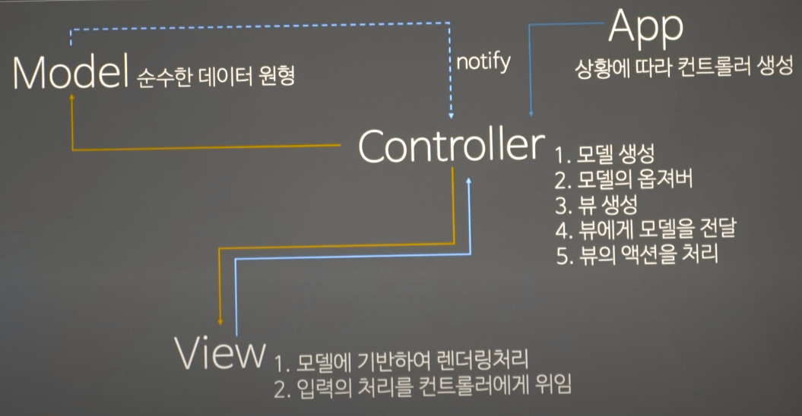
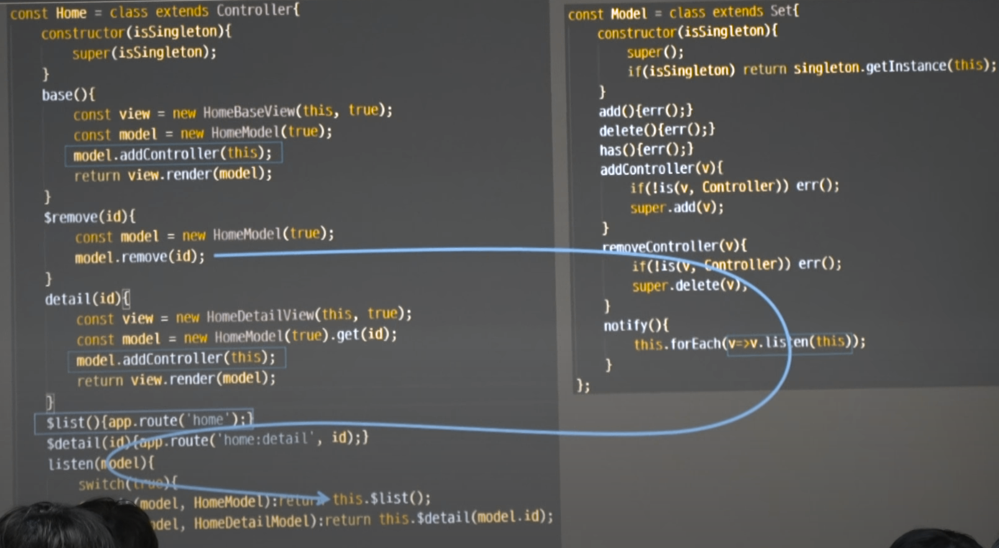
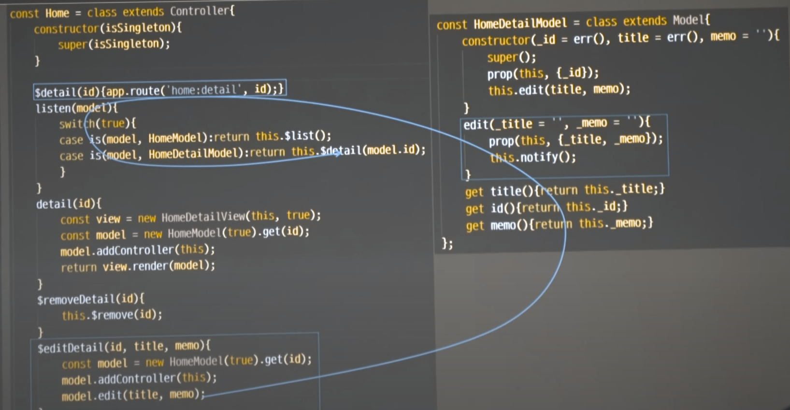

# MVC

## Singleton

객체를 계속 만드는 경우와 하나를 계속 유지하는 경우가 있다. 웹 개발 용어에선 이것을 메모리 컨텍스트에 따라 3가지가 등장한다. 

1. application: 웹서버가 죽을때까지 계속 떠있는 메모리
2. session: 유저가 로그인해서 로그아웃할때까지 유지되는 메모리
3. request: 하나의 요청당 존재하는 메모리를 구분한다

이중 appication 레벨의 메모리는 singleton 이다. 자바스크립트에선 이걸 weekmap을 이용하여 손쉽게 사용할 수 있다.

es6에선 코어 객체를 상속받을 수 있다. es3까지의 prototype의 chain으로 생각했다면 큰 착각이다. es6는 완전히 다른 형태로 객체를 만들어 낸다. 그렇기 때문에 코어 객체 상속이 가능하다. 코어 상속이 가능한 이유로 그전까진 자식객체가 만들어지고 prototypechain으로 부모를 알고 있었는데, 지금은 new 하면 부모클래스의 인스턴스를 만들고 아래 애들을 참조하는 형식으로 바뀌었다. 그래서 배열을 상속받으면 배열 객체가 나오는것이다. 인스턴스를 만드는 방향이 완전히 바뀐것이다.

WeakMap은 객체를 키로쓰고 값을 넣을 수 있다. 그냥 맵은 키는 값으로만 가능했다. WeakMap은 key가 참조이다. 어떤 객체를 기반으로 어떤 값을 얻어내고 싶다면 weakMap을 쓴다.

```js
const Singleton = class extends WeakMap{
  has(){error();}
  get(){error();}
  set(){error();}
  getInstance(v){
    if(!super.has(v.constructor)) super.set(v.constructor, v);  // 생성자를 키로 쓰고 있다. 이것은 class당 instance 하나만 만들어주는 singleton이다.
    return super.get(v.constructor);
  }
}
```

자바스크립트 생성자 특성
자바스크립트 생성자가 new에 반응해서 아무것도 리턴하지 않거나 primitive 값을 리턴하면 원래 그 객체의 this가 반환이 된다. 근데 primitive 값이 아닌 객체를 반환하면 new의 결과가 객체가 나온다. 개별 인스턴스를 얻을 건지 싱글톤을 얻을건지 결정할 수 있게 해준다.

```js
const singleton = new Singleton;

const Test = class{
  constructor(isSingleton){ //이걸 만든 이유는 똑같이 new를 때리지만 싱글톤 객체를 만드는 별도의 제너레이터나 서비스 레이어를 만들기 싫어서 이렇게 만든것이다.
    if(isSingleton) return singleton.getInstance(this);
  }
};

const test1 = new Test(true), test2 = new Test(true), test3 = new Test(); //singleton이 false일 경우엔 자기 자신이 나온다.
console.log(test1 === test2); // true
console.log(test2 === test3); // false
```

static으로 만들고 싶다는 생각이 든다면 뭔가 잘못 만들고 있다는 의심을 꼭 해야한다. 인스턴스와 메서드를 만들때, 싱글턴으로 다 스태틱으로 만들어도 되는데 그 싱글톤 객체는 스태틱으로 만들어서 한개밖에 안되는데 인스턴스로 만들면 수많은 싱글턴 인스턴스를 만들어 상황에 맞게 분리해서 쓸 수 있다. 객체지향 프로그래밍을 하는데 static의 유혹에 빠지면 뭔가 잘못된것이다. 똑같은 스태틱은 언제나 인스턴스로 바꿀 수 있다. 객체지향은 컨텍스트를 사용하며 컨텍스트는 인스턴스에서 발생한다. 클래스에 소속된 static은 클래스 context라고 불리긴 하지만 실제적으로 객체지향이 원하는 컨텍스트는 아니다. 객체지향은 인스턴스의 컨텍스트를 원한다.
언제 static의 유혹에 빠질까 ? 어떤 인스턴스의 참조를 줄 방법이 없을때 빠지게 된다. 커뮤니케이션을 설계하고 싶지 않을때 그 유혹에 빠진다. 객체들은 객체 망을 형성에서 서로의 의존성을 정리하고 서로 협력해서 문제를 해결해야하는데 갑자기 어디서 나타났으면 좋겠다고 생각할때 static의 유혹에 빠지는것이다. 객체지향은 끝나는거다.

### Controller



컨트롤러는 이 모델을 조작해서 뭔가를 하고싶다. 그림을 그리고 싶은 것이다. 이 컨트롤러가 최종적으로 하고 싶은건 데이터를 가져다 뷰로 바꾸고 싶은것이다. 컨트롤러의 첫번째 책임은 모델을 가져오거나 생성하는 것이다. 또 모델의 변화를 컨트롤러가 수집하고 싶다. 하지만 약하게 바인딩 해서 observing하고싶다. 모들이 subject가 되고 controller가 observer가 된다. 모델의 변화를 컨트롤러가 캐치하는 이유는 그림을 다시 그리기 위해서이다. mvc에선 view도 컨트롤러가 만든다. 뷰는 모델에 기반하여 렌더링을 처리한다. mvc mvp mvvm의 모든 차이는 view와 model과의 관계에서 발생한다. mvc는 뷰가 모델을 안다. 컨트롤러가 뷰한태 모델을 준다. 그렇기 때문에 뷰는 모델을 갖고 그림을 그릴 수 있는 책임을 갖게 된다. 그럼 컨트롤러는 그림을 그릴땐 관여를 하지 않는다. 모델과 뷰들 만들고 그 둘 사이에 연결해주는 책임만 진다. 그림은 모델을 갖고 그림을 그리는건 모두 뷰가 책임을 진다. 뷰는 모델을 기반으로 그림을 그리는 요소이다. 그럼 모델에 변화가 일어나면 원래 view가 수신해야된다. observing을 컨트롤러가 하는게 아니라 view가 받는게 정상처럼 보인다. 왜 이렇게 안되있냐면 모델의 변화를 뷰가 받아서 그림을 그릴 수 없기 때문이다. 뷰는 전체 공정중에 일부만 그리게 되어있다. 컨트롤러가 전체 공정을 다 알고 있고 데이터의 후 처리라던지 컨트롤러의 상황을 더 넣어준다던지 이런 추가작업을 한 모델을 넣어주기도 한다. 그래서 뷰가 수신해도 방법이 없다. 컨트롤러 거쳐갔다 와야하기 때문이다. 그래서 뷰는 기본적으로 그림을 모델에 기반하여 그린다.

하지만 뷰는 단지 그림만 그리진 않는다. 내가 만든 프런트엔드는 spring같이 서버에서 만들 경우 view를 만들어 클라이언트에 쏘면 끝이다. 그러면 더이상 callback이 일어나지 않는다. 하지만 우리가 만든 frontend 뷰에선 뷰를 그리고나면 뷰에서 클릭하면 무엇이 일어난다. 그래서 입력처리를 뷰가 UI 단에서 받긴 한다. clickListener이라던지 overListener을 받긴 한다. 하지만 이 처리는 controller에게 위임한다. 그럼 view는 model도 알고 controller도 알게 되는것이다. 일반적인 mvc에서 view는 model과 controller 둘다 알고 있다. 모델은 그림 그리기 위해 알고있는것이고 controller는 interaction을 controller에게 위임하기 위해 알고 있다. 그렇다면 controller에게 책임이 한개 더 들어가는 것이다. view에게 reaction이 오면 controller이 처리해줘야한다.

controller가 하는일

1. 모델 생성
2. 모델의 옵저버
3. 뷰 생성
4. 뷰에게 모델을 전달
5. 뷰의 액션을 처리

view가 하는일

1. 모델에 기반하여 렌더링처리
2. 입력의 처리를 컨트롤러에게 위임

그럼 controller는 누가 만드나? model하고 view는 컨트롤러가 만든다. controller를 만드는 애를 router 또는 app 그리고 spring에선 springMVC라는 이름으로 역할을 수행하고 있는데, 일반적으로 APP이라고 불린다. APP이 여러가지 routing 정보를 기반으로 컨트롤러를 만들게 되는거다.

Controller가 하는일이 너무 많다. 이 모델을 흔히 제왕적 컨트롤러 모델이라고 한다. mvc에는 컨트롤러가 뷰의 액션을 처리하는애가 있는데 이 경우엔 나머지 1,2,3,4는 APP이 만들어준다. 이런 상황에선 controller가 힘이 없기 때문에 view가 모델을 바로 수신할 수 있다.

여기서 문제는 Controller가 너무 할일이 많아서 이쁘게 만들수가 없다. mvc의 가장 큰 단점은 controller를 만드는데 뛰어난 개발자가 필요하다는것이다. controller를 만들기가 너무 힘들다. 컨트롤러 하나 만들고 나면 메서드 하나의 길이가 너무 길다.

MVC로 만들어 보자!

### Model

observing 외엔 순수한 데이터 원형을 제공한다.

```js
const Model = class extends Set{
  constructor(isSingleton){
    super();
    if(isSingleton) return signleton.getInstance(this);
  }
  add(){err();}
  delete(){err();}
  has(){err();}
  addController(v) {
    if(!is(v, Controller)) err();
    super.add(v);
  }
  removeController(v) {
    if(!is(v, Controller)) err();
    super.delete(v);
  }
  notify(){
    this.forEach(v=>v.listen(this));
  }
}

const HomeDetailModel = class extends Model{
  constructor(_id = err(), _title = err(), _memo = ''){
    super();
    prop(this, {_title, _id, _memo});
  }
  get title(){return this._title;}
  get id(){return this._id;}
  get memo(){return this._memo;}
}

//이게 바로 게시판 리스트가 될 녀석이다.
const HomeModel = class extends Model{
  constructor(isSingleton){
    super(isSingleton); //super에서 sington이 만들어진 다음에 그 다음에 그 자식의 생성자 상황은 뭘까? super가 return을 배열로 했다면 이 밑의 this는 뭘까? 배열일까 아니면 이 instance일까? super에 갔다 오면 this가 변할 수 있다. 따라서 super에서 singleton 처리하면 자식이 받았을땐 이미 singleton인 것이다.
    if(!this._list) prop(this, {_list:[
      new HomeDetailModel(1, 'todo1', 'memo1'),
      new HomeDetailModel(2, 'todo2', 'memo2'),
      new HomeDetailModel(3, 'todo3', 'memo3'),
      new HomeDetailModel(4, 'todo4', 'memo4'),
      new HomeDetailModel(5, 'todo5', 'memo5'),
    ]})
    add(...v){this._list.push(...v);}
    remove(id){
      const {_list: list} = this;
      if(!list.some((v, i) => { //some 또는 every는 foreach, map, reduce와 다르게 중간에 끊을 수 있다.
        if(v.id == id) {
          list.splice(i, 1);
          return true;
        }
      })) err();
      this.notify();
    }
  }
}
//결국 모델은 view가 갖다 쓸것이다.
get list(){return [...this._list];}
get(id) {
  let result;
  if(!this._list.some(v=>v.id == id ? (result = v) : false)) err(); // 이렇게 어떻게든 for와 while을 안쓰도록 해본다.
  return result;
}
```

### View

```js
const View = class {
  constructor(_controller = err(), isSingleton = false) {
    prop(this, {_controller});
    if(isSingleton) return singleton.getInstance(this);
  }
  render(model = null){override();}
}
//리스트를 그리는 뷰
const HomeBaseView = class extends View{
  constructor(controller, isSingleton) {
    super(controller, isSingleton);
  }
  render(model = err()){
    if(!is(model, HomeModel)) err();
    const {_controller:ctrl} = this;
    return append(el('ul'), ...model.list.map(v=>append(
      el('li'),
      el('a', 'innerHTML', v.title, 'addEventListener', ['click', _=>ctrl.$detail(v.id)]), //$는 컨트롤러 메서드중에 action 리스너에만 이 표시를 붙혀줄것이다.
      el('button', 'innerHTML', 'x', 'addEventListener', ['click', _=>ctrl.$remove(v.id)])
    )));
  }
};
//디테일 그리는 뷰
const HomeDetailView = class extends View{
  constructor(controller, isSingleton) {
    super(controller, isSingleton);
  }
  render(model = err()) {
    if(!is(model, HomeDetailModel)) err();
    const {_controller:ctrl} = this;
    return append(el('section'),
      el('h2', 'innerHTML', model.title),
      el('p', 'innerHTML', model.memo),
      el('button', 'innerHTML', 'delete', 'addEventListener', ['click', _=>ctrl.$removeDetail(model.id)]),
      el('button', 'innerHTML', 'list', 'addEventListener', ['click', _=>ctrl.$list()])
    );
  }
}
```

mvc에는 뷰가 모델을 알고 있어서 모델이 데이터 모델링의 사정으로 필드가 수정 추가 삭제될 수 있는데 즉시 view에 영향을 끼친다. view가 movel과 커플링 되어져 있는게 어렵다. 이게 mvc의 큰 단점중 하나이다. mvc에선 business 로직이 바뀌어 model이 바뀌면 view가 다 고쳐져야한다. 이 괴로움 때문에 mvp와 mvvm이 나온것이다. view가 model을 모르게 하기 위해서

어떻게 뷰가 모델을 모르게할까?

1. 뷰가 자기의 모든 필드에 대해 게터세터를 제공해버린다. 컨트롤러는 뷰만 바라보고 게터세터만 호출하면 된다. 뷰는 아예 다 모르게 되는것이다. view의 기능은 getter setter 노출만 하면 된다. 이게 바로 mvp 이다. mvp에선 presenter라는 컨트롤러가 뷰를 바라보면 뷰의 getter setter밖에 없다. 뷰는 아예 모델을 모르는것이다. 대신 뷰하나 만들때마다 많은 게터세터를 만들어야한다. visual studio는 알아서 다 만들어준다. 근데 js는 만들어주는애가 없어서 안쓰는것이다. 만들어주는애가 있어서 mvp가 확 떴던 것이다. 프레젠터만 모델을 알고 있고 이것을 해석해서 view의 getter setter를 부르는것이다. 이러면 모델의 변화가 뷰에 영향을 끼치지 않는다.
2. mvvm은 뷰가 모델을 알게하는게 아니라 가짜 모델이 뷰를 알게 하게한다. view와 model view가 바인딩 된다. modelview가 주도적으로 view을 업데이트 하려고 하는것이다. view와 상호작용 해서. 이 경우엔 뷰가 모델과 원활히 상호작용할 수 있는 시스템이 필요하다. 아깐 getter setter만 만들었다면 이번엔 지능적으로 뷰를 모델을 이용해서 업데이트할 수 있게 모델이 뷰를 알게 바꾸는것이다. 모델이 뷰를 알게하면 뷰는 몰라도 된다. 어떻게 하면 뷰는 모델을 모르는데 모델은 뷰를 컨트롤할까? 모델은 서버에서 받은 날것이고, 뷰를 위해 재정립한 모델을 뷰모델이라고한다. 뷰모델이 뷰를 보고 data 바인딩을 통해서 해당키에 자동으로 연결해준다. mvvm은 binding하는 엔진만 만들면 뷰마다 게터세터 를 만드는 작업이 없어지면서 뷰는 여전히 모델을 모르게된다.

프런트엔드는 mvc가 지옥인데, 서버는 restapi로 넘어가면서 json만 리턴하면 되니까 view 로직이 없어졌다. 이렇게 서버가 json또는 xml만 리턴하는 곳에선 mvc가 단점은 없어지고 장점만 남은것이다. 뷰와 모델의 의존성에 영향이 없으니까. 자동화된 뷰를 만드니까.

### Controller를 보자

```js
const Home = class extends Controller{
  constructor(isSingleton) {
    super(isSingleton);
  }
  base(){
    const view = new HomeBaseView(this, true);  // 컨트롤러는 모델과 뷰를 만들고 뷰에 모델을 전달하는 역할까지 잘 하고 있다.
    const model = new HomeModel(true);
    return view.render(model);
  }

  //액션과 화면을 처리하는 메서드를 구분하는걸 추천한다.
  $detail(id){app.route('home:detail', id);}  // 화면을 전환하는것은 우리가 할일이 아니다. 어플리케이션이 할일이다.
  $remove(id){
    const model = new HomeModel(true);
    model.remove(id);
    this.$list(); // 나중에 옵저버로 고치는걸로 하자.
  }
  $detail(id){
    const view = new HomeDetailView(this, true);
    const model = new HomeModel(this);
    return view.render(model.get(id));
  }
  $list(){app.route('home');}
  $removeDetail(id){
    this.$remove(id);
    this.$list(); // 나중에 옵저버로 고치는걸로 하자.
  }
}
```

화면 하나에 하나의 컨트롤러 만드는것은 너무 힘들고 컨트롤러 클래스 하나에 메소드가 화면 하나를 감당하게 만든다.

마지막으로 app을 보자.

```js
const app = new App('#state');
app.add('home:detail', _=>new Home(true));
app.route('home');

const App = class {
  constructor(_parent, {_table: new Map});
}
add(k = err(), controller = err()) {
  k = k.split(':');
  this._table.set(k[0], controller);
  (k[1] || '').split(',').concat('base').forEach(v=>this._table.set());
}
route(path = err(), ...arg) {
  const [k, action = 'base'] = path.split(':');
  if(!this._table.has(k)) return;
  const controller = this._table.get(k)();
  append(attr(sel(this._parent), 'innerHTML', ''), controller[action](...arg));
}
```

mvc 개념상으론 뷰가 모델을 수신하면 좋지만 뷰가 모델을 수신해서 화면은 갱신할 순 없다. 반드시 앱을 타야한다. 그래서 controller를 경유하는 것이다.

이걸 통해 우린 개별 뷰에 대한 로직과 개별 컨트롤러 모델에 대한 로직을 모델 뷰 컨트롤러로 분산해서 만들 수 있다. 물론 mvc에서 view같은 경우 model controller를 다 알고 있어서 피곤하다.

### Observer를 적용하자

 ```js
const Home = class extends Controller{
  constructor(isSingleton) {
    super(isSingleton);
  }
  base(){
    const view = new HomeBaseView(this, true);  
    const model = new HomeModel(true);
    model.addController(this);
    return view.render(model);
  }

  $detail(id){app.route('home:detail', id);} 
  $remove(id){
    const model = new HomeModel(true);
    model.remove(id);
  }
  $detail(id){
    const view = new HomeDetailView(this, true);
    const model = new HomeModel(this);
    model.addController(this);
    return view.render(model);
  }
  $list(){app.route('home');}
  $detail(id){app.route('home:detail', id);}
  listen(model){
    switch(true){
      case is(model, HomeModel): return this.$list();
      case is(model, HomeDetailModel): return this.$detail(model.id);
    }
  }
  $removeDetail(id){
    this.$remove(id);
  }
  $editDetail(id, title, memo){
    const model = new HomeModel(true).get(id);
    model.addController(this);
    model.edit(title, memo);
  }
}

const HomeDetailView = class extends View{
  constructor(controller, isSingleton) {
    super(controller, isSingleton);
  }
  render(model = err()) {
    if(!is(model, HomeDetailModel)) err();
    const {_controller:ctrl} = this;
    const sec = el('section');
    return append(sec,
      el('input', 'value', model.title, '@cssText', 'display:block', 'className', 'title'),
      el('textarea', 'innerHTML', model.memo, '@cssText', 'display:block', 'className', 'memo'),
      el('button', 'innerHTML', 'edit', 'addEventListener', ['click', _=>ctrl.$removeDetail(model.id, sel('.title'm sec).value, sel('.memo', sec).value)]),
      el('button', 'innerHTML', 'delete', 'addEventListener', ['click', _=>ctrl.$removeDetail(model.id)]),
      el('button', 'innerHTML', 'list', 'addEventListener', ['click', _=>ctrl.$list()])
    );
  }
}
```




